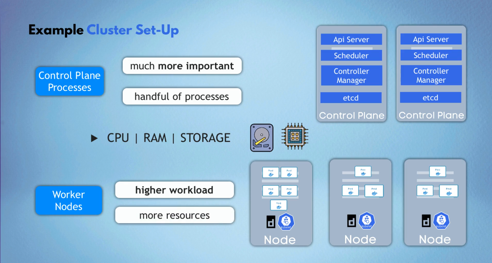
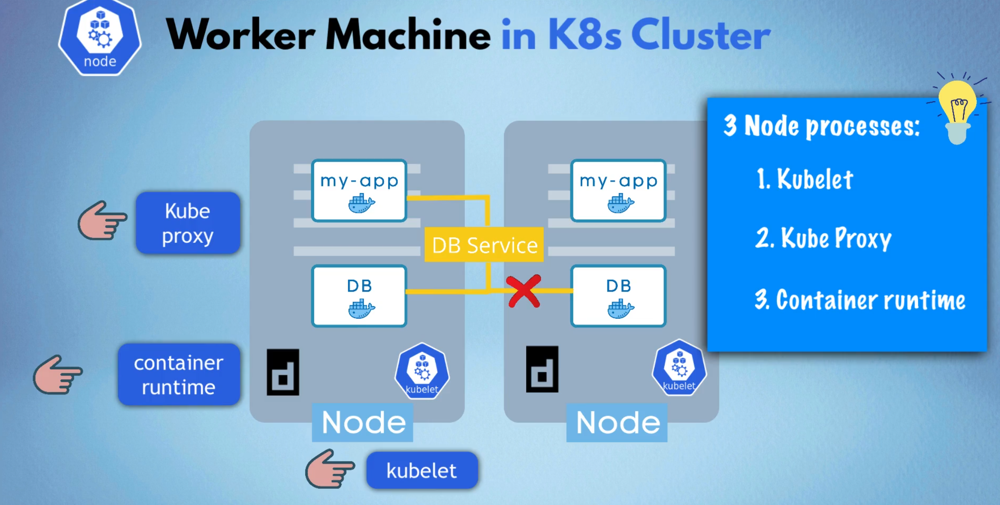
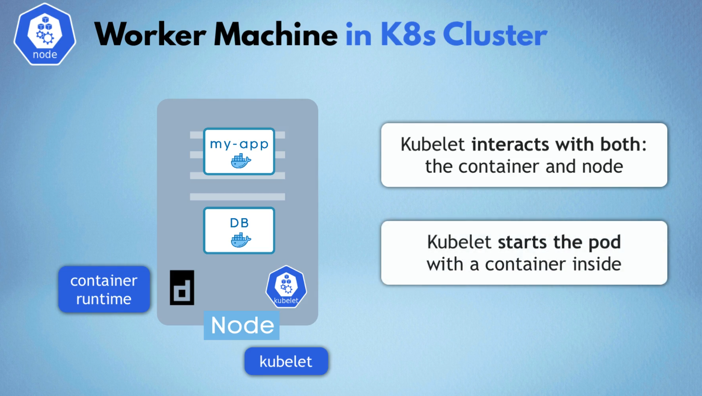
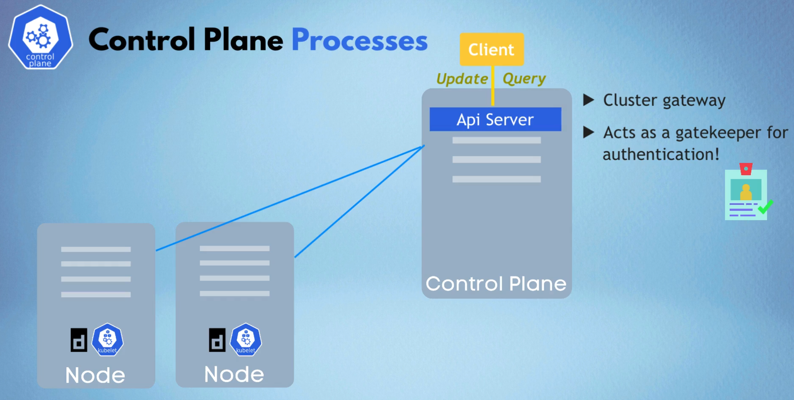
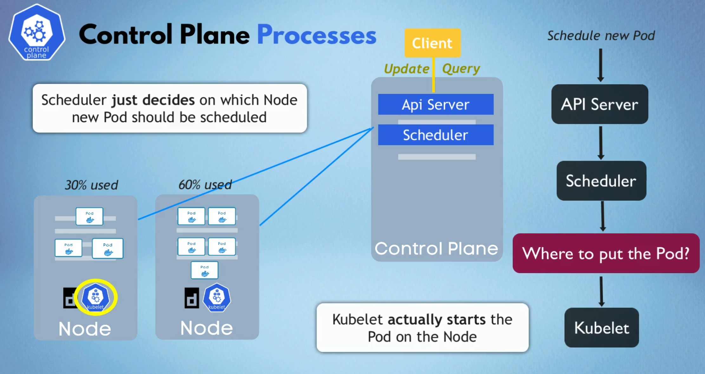
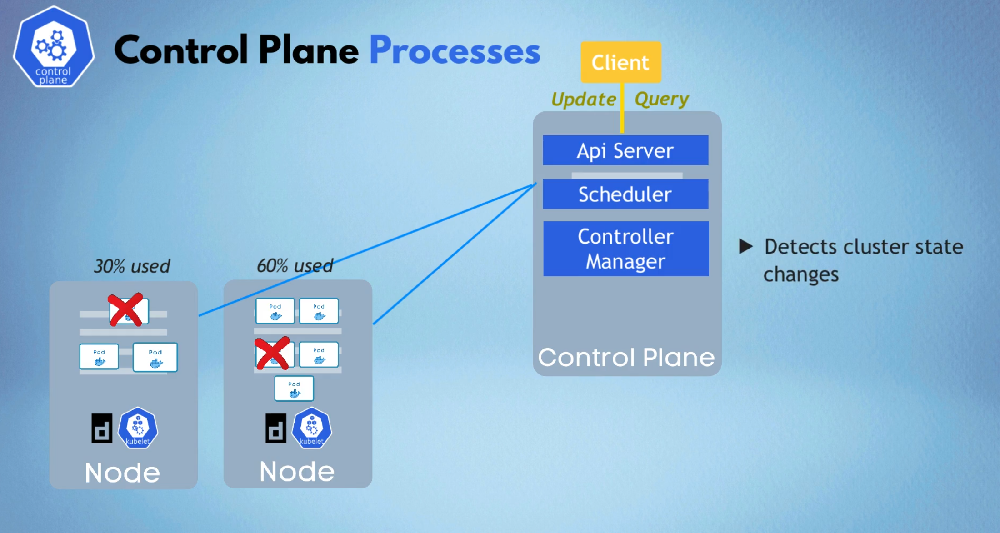
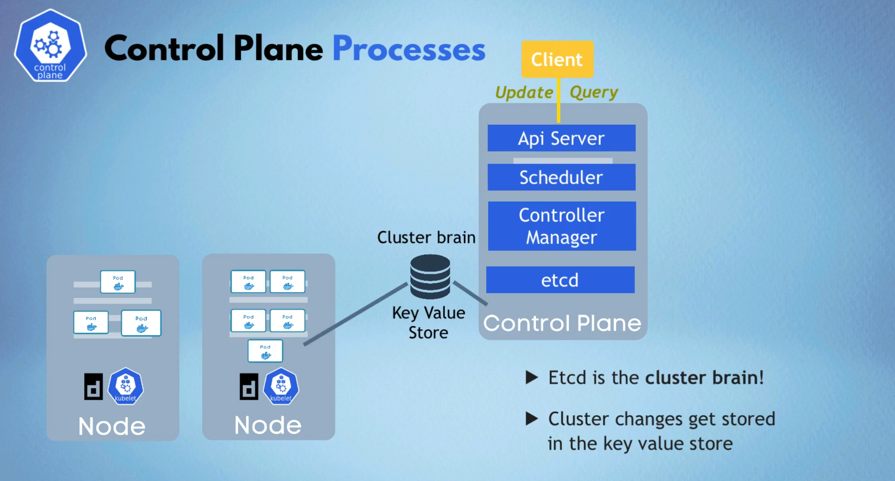

# Kubernetes Architecture

## Overview

Kubernetes follows a **Master-Worker** architecture pattern where the cluster consists of:
- **Control Plane** (Master Node): Manages the cluster
- **Worker Nodes**: Run the actual application workloads

---

## Control Plane and Node Architecture

### Control Plane (Master Node)
The Control Plane is responsible for managing the Kubernetes cluster. It makes global decisions about the cluster and detects and responds to cluster events.

### Worker Nodes
Worker nodes are the machines that run your application workloads. Each worker node communicates with the control plane and runs the necessary services to support pods.

---

## Node Processes (Worker Node Components)

Every worker node runs three essential processes:

### 1. Kubelet

- **Primary node agent** that runs on each worker node
- **Communicates** with the Control Plane (API Server)
- **Manages pods** and their containers on the node
- **Ensures containers** are running in a pod as expected
- **Reports node status** back to the Control Plane
- **Receives pod specifications** (PodSpecs) and ensures containers described in those PodSpecs are running and healthy

### 2. Kube Proxy
- **Network proxy** that runs on each worker node
- **Maintains network rules** that allow communication to pods from network sessions inside or outside the cluster
- **Implements part of the Kubernetes Service concept**
- **Handles load balancing** for services across multiple pods
- **Manages iptables rules** for routing traffic to the correct pods

### 3. Container Runtime
- **Software responsible** for running containers
- **Examples**: Docker, containerd, CRI-O
- **Pulls container images** from registries
- **Starts and stops containers** as instructed by kubelet
- **Manages container lifecycle**

---

## Control Plane Processes

The Control Plane consists of four main components:

### 1. API Server

- **Central management entity** and entry point for all REST commands
- **Gateway to the cluster** - all requests go through the API Server
- **Validates and processes** REST operations
- **Authentication and authorization** point
- **Stores cluster state** in etcd
- **Only component** that directly communicates with etcd
- **Exposes Kubernetes API**

### 2. Scheduler

- **Responsible for** scheduling pods on worker nodes
- **Watches for newly created pods** with no assigned node
- **Selects optimal node** for pod placement based on:
  - Resource requirements (CPU, memory)
  - Hardware/software/policy constraints
  - Affinity and anti-affinity specifications
  - Data locality
  - Inter-workload interference
- **Does not actually start the pod** - kubelet does that
- **Makes scheduling decisions** but delegates to kubelet for execution

### 3. Controller Manager

- **Runs controller processes** that regulate the state of the cluster
- **Makes requests to Scheduler** when pods need to be rescheduled
- **Performs resource calculations** to determine optimal placement
- **Decides which worker node** should restart/reschedule pods
- **Sends responses to corresponding worker nodes** to restart pods
- **Examples of controllers**:
  - Node Controller: Monitors node health
  - Replication Controller: Maintains correct number of pods
  - Endpoints Controller: Manages endpoint objects
  - Service Account & Token Controllers: Create default accounts and API access tokens

### 4. etcd - Key-Value Store

- **Distributed key-value store** that serves as Kubernetes' backing store
- **Stores all cluster data** including:
  - What resources are available?
  - Did the cluster state change?
  - Is the cluster healthy?
  - Configuration data
  - Secrets and ConfigMaps
  - Service discovery information

#### Important Notes about etcd:
- ⚠️ **Application data is NOT stored in etcd**
- Only stores **cluster state and configuration data**
- **Highly available** and **consistent**
- **Only the API Server** communicates directly with etcd
- **Critical for cluster operation** - if etcd fails, the cluster cannot function

---

## DB Service

Kubernetes doesn't provide a built-in database service, but supports various database deployments:

### Database Options:
1. **StatefulSets** - For stateful applications like databases
2. **Persistent Volumes** - For data persistence
3. **Operators** - For managing complex database deployments
4. **External Databases** - Connecting to databases outside the cluster

### Key Considerations:
- **Data persistence** across pod restarts
- **Backup and recovery** strategies
- **High availability** configurations
- **Resource management** (CPU, memory, storage)

---

## Communication Flow

1. **User/Application** → API Server (Authentication & Authorization)
2. **API Server** → etcd (Store/Retrieve cluster state)
3. **API Server** → Scheduler (Pod placement decisions)
4. **Scheduler** → API Server (Scheduling decisions)
5. **API Server** → Controller Manager (Cluster state management)
6. **Controller Manager** → API Server (State change requests)
7. **API Server** → Kubelet (Pod specifications)
8. **Kubelet** → Container Runtime (Container management)
9. **Kube Proxy** → Manages network routing for services

This architecture ensures **high availability**, **scalability**, and **fault tolerance** in Kubernetes clusters.