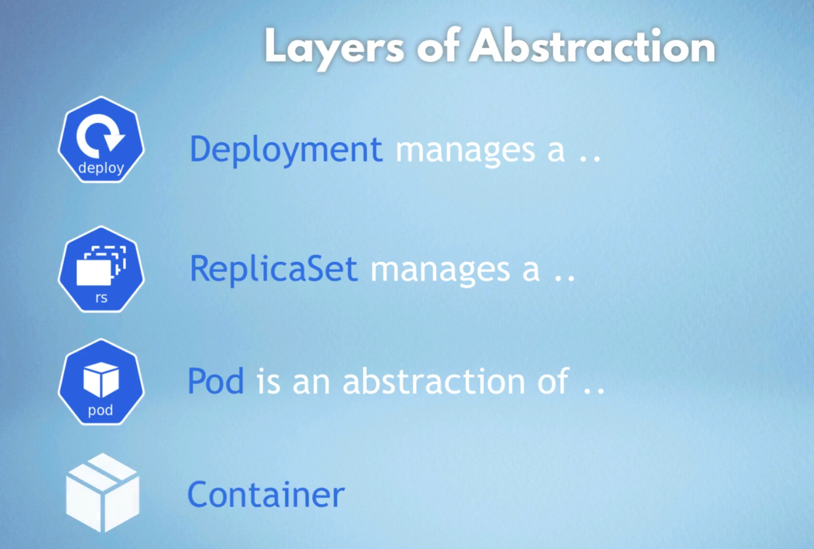

# Kubernetes Commands Reference

## Essential Commands Overview
```bash
minikube

kubectl

minikube start --driver docker

minikube status

kubectl get node

kubectl get pod

kubectl get services

kubectl create deployment nginx-depl --image=nginx

kubectl get deployment

kubectl get pod

kubectl get replicaset

kubectl edit deployment nginx-depl (opens configuration file)

kubectl logs nginx-depl-7654c475cf-2sgmb

kubectl create deployment mongo-deployment --image=mongo

kubectl get pod

kubectl describe pod mongo-deployment-64d449895-hldfp

kubectl get pod

kubectl exec -it mongo-deployment-64d449895-hldfp -- bin/bash

ls

exit

kubectl get deployment

kubectl get pod

kubectl delete deployment mongo-deployment

kubectle get replicaset


Now by using Configuration file

kubectl apply -f config-file.yaml

touch nginx-deployment.yaml

vim nginx-deployment.yaml
```
### Minikube Commands
```bash
minikube
minikube start --driver docker
minikube status
```

### Basic kubectl Commands
```bash
kubectl
kubectl get node
kubectl get pod
kubectl get services
kubectl get deployment
kubectl get replicaset
```

### Deployment Commands
```bash
kubectl create deployment nginx-depl --image=nginx
kubectl create deployment mongo-deployment --image=mongo
```

### Configuration and Inspection
```bash
kubectl edit deployment nginx-depl
kubectl logs nginx-depl-7654c475cf-2sgmb
kubectl describe pod mongo-deployment-64d449895-hldfp
kubectl exec -it mongo-deployment-64d449895-hldfp -- bin/bash
```

### File-based Configuration
```bash
kubectl apply -f config-file.yaml
touch nginx-deployment.yaml
vim nginx-deployment.yaml
```

### Cleanup Commands
```bash
kubectl delete deployment mongo-deployment
```
---

## Detailed Command Explanations

### 1. Minikube - Local Kubernetes Cluster

**`minikube`**
- Displays help and available commands for Minikube
- Minikube is a tool that runs a single-node Kubernetes cluster locally

**`minikube start --driver docker`**
- Starts a local Kubernetes cluster using Docker as the virtualization driver
- Creates a containerized Kubernetes environment on your machine
- Alternative drivers include VirtualBox, VMware, or Hyper-V

**`minikube status`**
- Shows the current status of your Minikube cluster
- Displays information about cluster, kubelet, and apiserver status

### 2. kubectl - Kubernetes Command Line Interface

**`kubectl`**
- The command-line tool for interacting with Kubernetes clusters
- Displays help and available commands

---

## CRUD Operations with kubectl

### CREATE Operations

**`kubectl create deployment nginx-depl --image=nginx`**
- Creates a new deployment named "nginx-depl" using the nginx Docker image
- Automatically creates pods, replica sets, and manages the application lifecycle
- Imperative command for quick deployment creation

**`kubectl create deployment mongo-deployment --image=mongo`**
- Creates a MongoDB deployment using the official mongo Docker image
- Follows the same pattern as nginx deployment

**`kubectl apply -f config-file.yaml`**
- Declarative approach to create/update resources using YAML configuration files
- Preferred method for production environments
- Can create multiple resources from a single file

### READ Operations (Status & Information)

**`kubectl get node`**
- Lists all nodes in the cluster
- Shows node status, roles, age, and version

**`kubectl get pod`**
- Lists all pods in the current namespace
- Shows pod name, ready status, restarts, age, and IP

**`kubectl get services`**
- Lists all services in the current namespace
- Shows service name, type, cluster-IP, external-IP, and ports

**`kubectl get deployment`**
- Lists all deployments
- Shows name, ready replicas, up-to-date replicas, available replicas, and age

**`kubectl get replicaset`**
- Lists all replica sets
- Shows desired, current, and ready replica counts

### UPDATE Operations

**`kubectl edit deployment nginx-depl`**
- Opens the deployment configuration in your default editor
- Allows real-time editing of deployment specifications
- Changes are applied immediately upon saving

### DELETE Operations

**`kubectl delete deployment mongo-deployment`**
- Removes the specified deployment and all associated resources
- Automatically deletes pods and replica sets created by the deployment
- Use with caution in production environments

---

## Status of Different K8s Components

### Node Status
```bash
kubectl get node
```
- **Ready**: Node is healthy and ready to accept pods
- **NotReady**: Node has issues and cannot accept new pods
- **Unknown**: Node controller hasn't heard from the node

### Pod Status
```bash
kubectl get pod
```
- **Pending**: Pod accepted but not yet scheduled
- **Running**: Pod bound to node and containers are running
- **Succeeded**: All containers terminated successfully
- **Failed**: All containers terminated, at least one failed
- **Unknown**: Pod state cannot be determined

### Deployment Status
```bash
kubectl get deployment
```
- Shows replica counts: desired vs. current vs. available
- Indicates if deployment is progressing or complete

### Service Status
```bash
kubectl get services
```
- Shows how applications are exposed within or outside the cluster
- Displays cluster IPs, external IPs, and port configurations

---

## Debugging Pods

### Viewing Pod Logs
**`kubectl logs nginx-depl-7654c475cf-2sgmb`**
- Displays logs from a specific pod
- Essential for troubleshooting application issues
- Use `-f` flag to follow logs in real-time: `kubectl logs -f <pod-name>`

### Detailed Pod Information
**`kubectl describe pod mongo-deployment-64d449895-hldfp`**
- Provides comprehensive information about a pod
- Shows events, conditions, resource usage, and configuration
- Useful for diagnosing why a pod isn't starting or is failing


### Common Debugging Commands Inside Pods
```bash
ls                    # List files and directories
ps aux               # Show running processes
env                  # Display environment variables
cat /etc/hosts       # Check host configurations
netstat -tulpn       # Check network connections
```

---

### Sample YAML Structure
```yaml
apiVersion: apps/v1
kind: Deployment
metadata:
  name: nginx-deployment
  labels:
    app: nginx
spec:
  replicas: 2
  selector: 
    matchLabels:
      app: nginx
  template:
    metadata:
      labels:
        app: nginx
    spec:
      containers:
      - name: nginx
        image: nginx:1.25
        ports:
        - containerPort: 8080 
```

### Applying Configuration
**`kubectl apply -f nginx-deployment.yaml`**
- Applies the configuration from the YAML file
- Creates or updates resources as defined in the file
- Maintains desired state and can be version controlled

---

## Layers of Abstraction



The image above illustrates the different layers of abstraction in Kubernetes, showing how components interact from the lowest level (containers) to the highest level (services and ingress), providing a clear understanding of the Kubernetes architecture hierarchy.