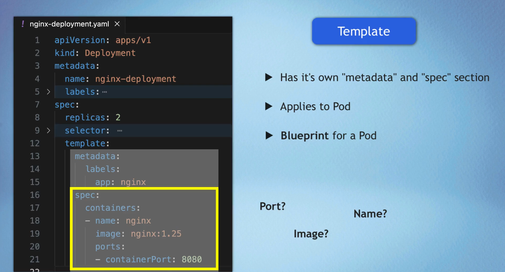
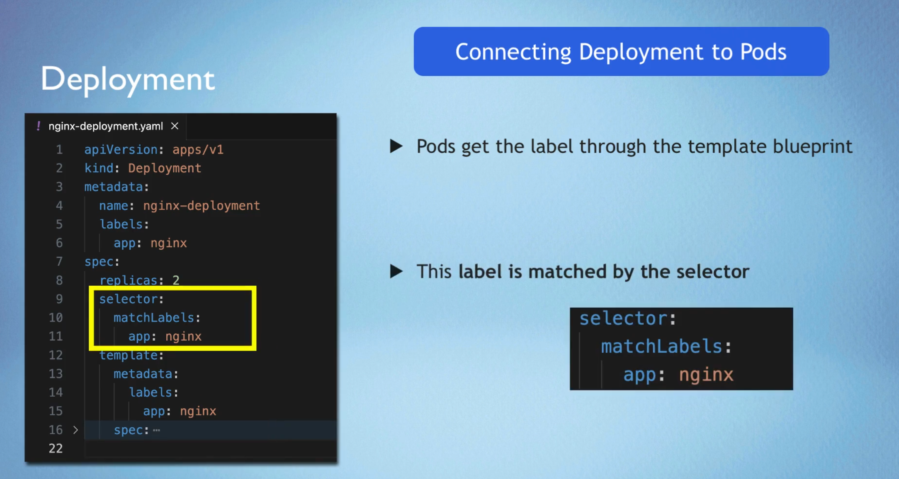
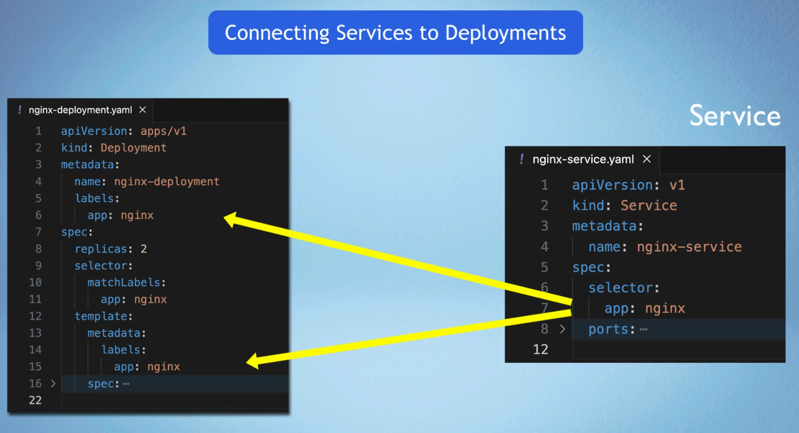
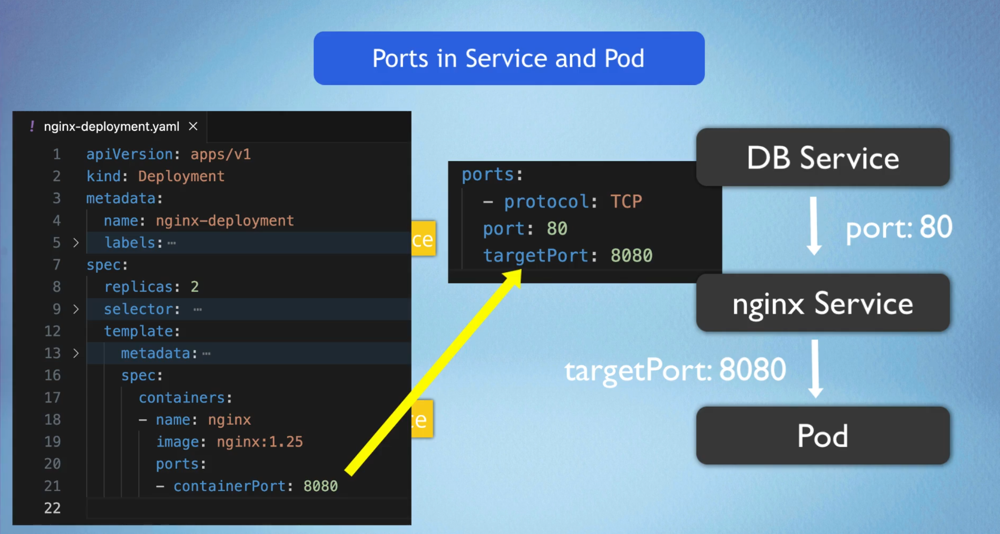

# Kubernetes Configuration Files

## Overview

Kubernetes configuration files are YAML or JSON documents that define the desired state of your Kubernetes resources. These files provide a declarative approach to managing your applications and infrastructure.

## Structure of Configuration Files

Each Kubernetes configuration file has **3 main parts**:

### 1. Metadata
- Contains information about the resource
- Includes name, namespace, labels, annotations
- Provides identification and organization details

### 2. Specification (spec)
- Defines the desired state of the resource
- Attributes are specific to the `kind` (deployment, service, pod, etc.)
- Contains the blueprint of what you want to create

### 3. Status
- **Automatically generated and added by Kubernetes**
- Shows the current actual state of the resource
- Compares **desired state** vs **actual state**
- Used by Kubernetes controllers to maintain desired state

## Basic Structure Template

```yaml
apiVersion: apps/v1        # API version (always first line)
kind: Deployment           # Resource type (always second line)
metadata:                  # Part 1: Metadata
  name: my-app
  labels:
    app: my-app
spec:                      # Part 2: Specification
  replicas: 3
  selector:
    matchLabels:
      app: my-app
  template:
    metadata:              # Template has its own metadata
      labels:
        app: my-app
    spec:                  # Template has its own spec
      containers:
      - name: my-app
        image: nginx
# status:                  # Part 3: Status (auto-generated by Kubernetes)
#   replicas: 3
#   readyReplicas: 3
```

## Key Points About Structure

### First Two Lines Always:
1. **`apiVersion`** - Specifies the API version for the resource type
2. **`kind`** - Defines the type of Kubernetes resource (Deployment, Service, Pod, etc.)

### Template Section
The `template` section in Deployments has its own:
- **`metadata`** - Labels for the pods created by this deployment
- **`spec`** - Container specifications and pod configuration

## Labels and Selectors

**Labels and Selectors** are the mechanism through which Kubernetes components find and connect to each other.

### How It Works:
- **`metadata.labels`** - Defines labels on the resource
- **`spec.selector`** - Specifies which resources to manage based on labels
- **Connection** - Selector matches labels to establish relationships

### Example:
```yaml
metadata:
  labels:
    app: nginx        # Label on the resource
spec:
  selector:
    matchLabels:
      app: nginx      # Selector matches the label
```

## Visual Reference





The image above shows the relationship between YAML deployment structure, labels, and selectors in Kubernetes configuration files.

---

## Configuration File Commands

### Applying Configuration Files

**`kubectl apply -f nginx-deployment.yaml`**
- Applies the deployment configuration from the YAML file
- Creates or updates the deployment based on the file contents
- Uses declarative approach (recommended for production)

**`kubectl apply -f nginx-service.yaml`**
- Applies the service configuration from the YAML file
- Creates or updates the service to expose the deployment
- Establishes networking rules for the application

### Checking Applied Resources

**`kubectl get pod`**
- Lists all pods created by the applied configurations
- Shows the current status of running pods
- Verifies that deployments are creating pods successfully

**`kubectl get service`**
- Lists all services in the current namespace
- Shows how applications are exposed (ClusterIP, NodePort, LoadBalancer)
- Displays port configurations and endpoints

### Detailed Resource Information

**`kubectl describe service nginx-service`**
- Provides detailed information about the specified service
- Shows endpoints, port mappings, and service events
- Useful for troubleshooting connectivity issues

**`kubectl get pod -o wide`**
- Lists pods with additional information including IP addresses
- Shows which node each pod is running on
- Displays internal IP addresses for networking troubleshooting

### Exporting Current State

**`kubectl get deployment nginx-deployment -o yaml > nginx-deployment-result.yaml`**
- Exports the current state of the deployment to a YAML file
- Includes the **status** section that Kubernetes automatically generates
- Shows what's actually stored in etcd (Kubernetes database)
- Useful for:
  - Backing up current configurations
  - Comparing desired vs actual state
  - Debugging configuration issues
  - Understanding how Kubernetes modifies your original configuration

### Cleaning Up Resources

**`kubectl delete -f nginx-deployment.yaml`**
- Deletes all resources defined in the nginx-deployment.yaml file
- Removes the deployment and all associated pods
- Uses the same file that was used to create the resources

**`kubectl delete -f nginx-service.yaml`**
- Deletes the service defined in the nginx-service.yaml file
- Removes the network access to the application
- Cleans up networking rules and endpoints

---
Each configuration file has 3 parts

1. metadata
2. Specification (attributes are specific to kind: deployment or service)
3. status (Automatically generated and added by Kubernetes desired? and actual?)
Template has its own "metadata and "spec" section
Labels and selectors: configuration is done by them, metadata has labels and spec part contains selector
Add the image of YAML-Deployment-Labels-Selectors all 3
the first two lines always the apiVersion and kind


next step is to run commands
---
```bash
kubectl apply -f nginx-deployment.yaml

kubectl apply -f nginx-service.yaml

kubectl get pod

kubectl get service

kubectl describe service nginx-service

kubectl get pod -o wide # to get ip address

kubectl get deployment nginx-deployment -o yaml > nginx-deployment-result.yaml # when you want to see the status stored in etcd and store it in yaml file named result.

kubectl delete -f nginx-deployment.yaml

kubectl delete -f nginx-service.yaml
```
