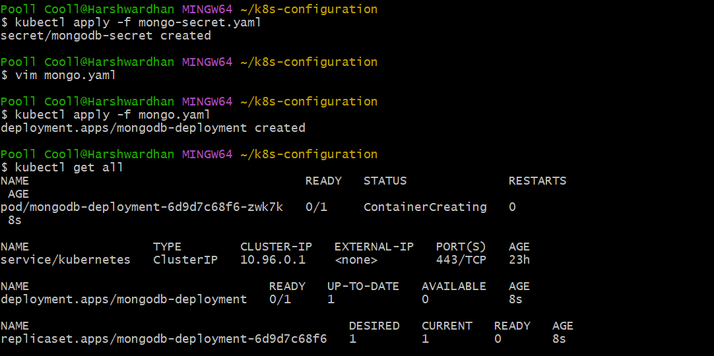
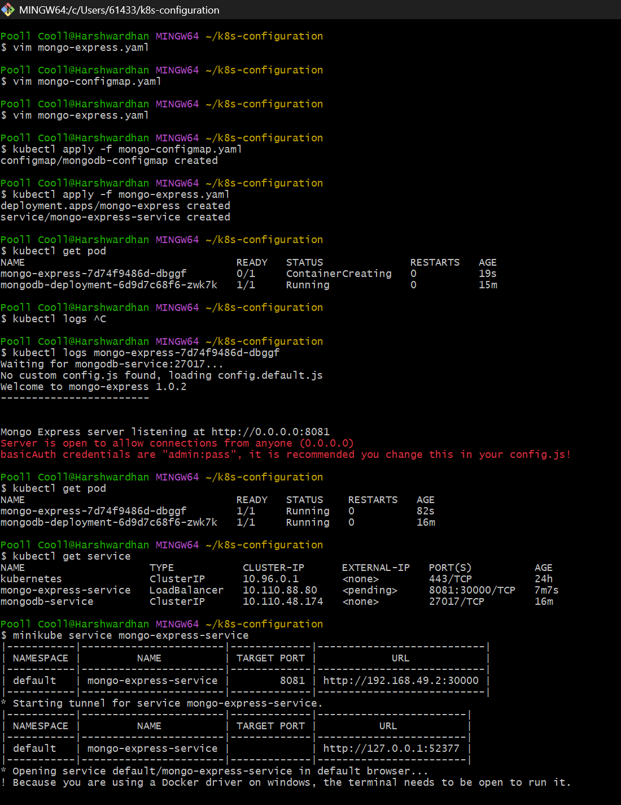

- how to expose the Service externally?
- type: LoadBalancer # check in mongo-express.yaml 
- Assigns service an external IP address and so accepts external requests

- nodePort: 
- Port for external ip address will be open
- Port you need to put into browser (30000 - 32767)

