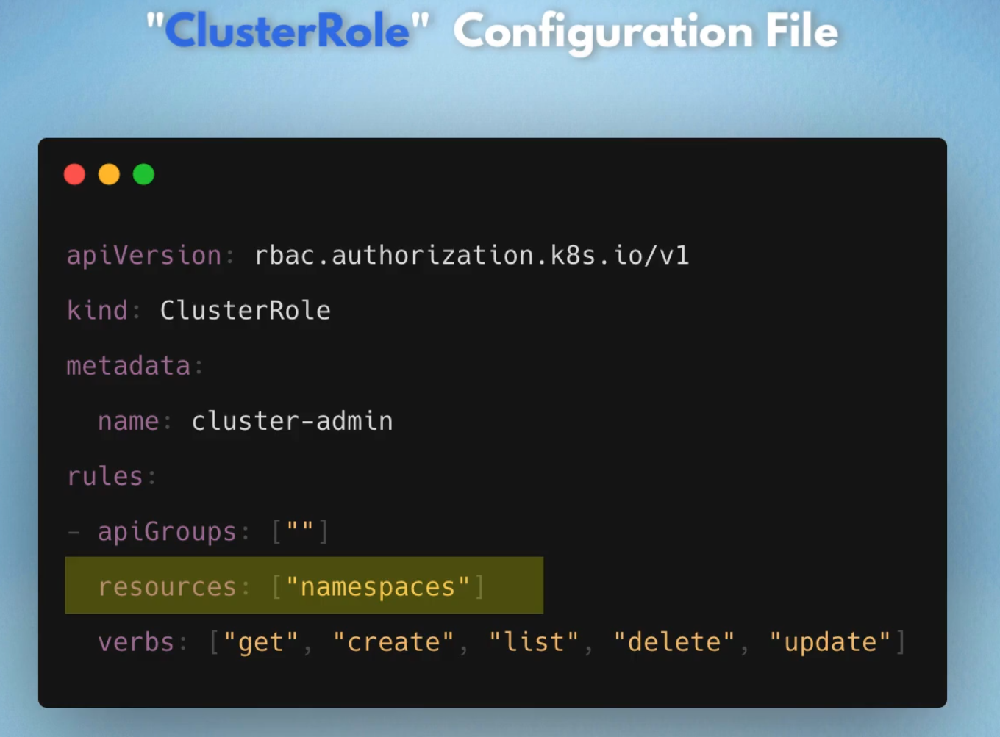
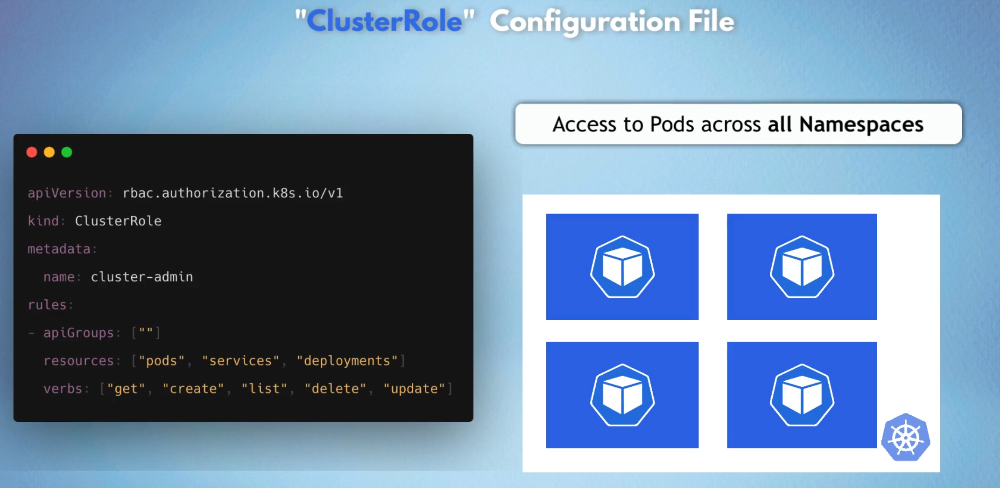
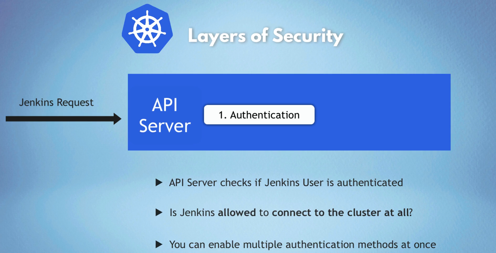
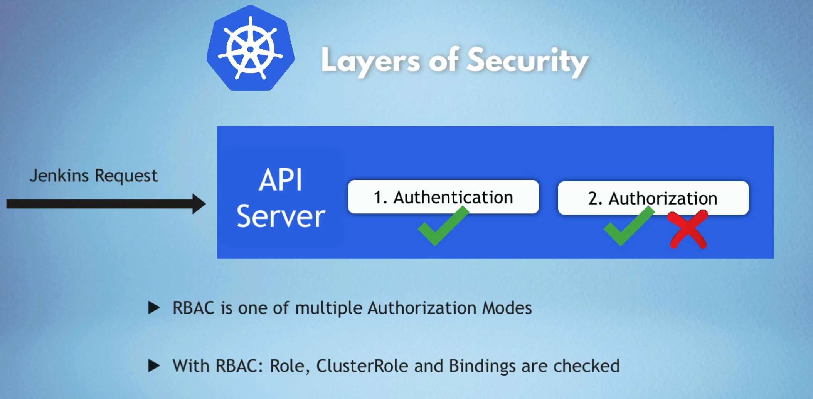

# RBAC - Role Based Access Control

- With Role component you can define namespaced permissions

- Bound to a specific Namespace

- What resources in that namespace you can access
    - Pod, Deployment, Service

- What actions can you do with this resource?
    - "list", "get", "update", "delete"

- you can create RBAC based on specific namespace

- Define Resources and access permissions
- No information on who gets these permissions

## Rolebinding 

## k8s Administrators
- Do Cluster wide operations
    - Managing namespaces in cluster
    - Configuring cluster-wide Volumes

## Cluster-RoleBinding
- Defines resources and permissions cluster wide

## How do we create Users and Groups?

- Kubernetes doesn't manage Users natively

- Admins can choose from different authentication strategies

- No Kubernetes Objects exist for representing normal user accounts

    - Depends external sources for Authentication
        - Static token file - token, user, id
        - Certificates
        - 3rd party identity service
- Admin Configures external source
    - API Server handles authentication of all requests
    - API Server uses one of these configured authentication methods
    - You can pass token via CLI `kube-apiserver --token-auth-file=/users.csv[other options]`

---

# Authorization for Applications

- Applications are inside the cluster and outside the cluster ex. prometheus for monitoring(internal) and jenkins for CICD(external) 
- We also want Apps to have only the permission it needs!

--- 
# Service Account - k8s component that represents an Application User
- User is not a k8s component on its own!
- kubectl create serviceaccount sa1
- Link ServiceAccount to Role with RoleBinding
- Link ServiceAccount to ClusterRole with ClusterRoleBinding

- in metadata you can add `namespace: my-app`

## Role binding config-file

---
## ClusterRole config-file
<table>
<tr>
<td></td>
<td></td>  
</tr>
</table>

## Creating and viewing commands

## Checking Api access

# Layers of Security Authentication Vs Authorization
<table>
<tr>
<td></td>
<td></td>  
</tr>
</table>

